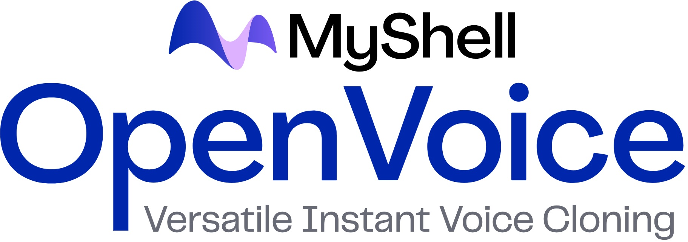
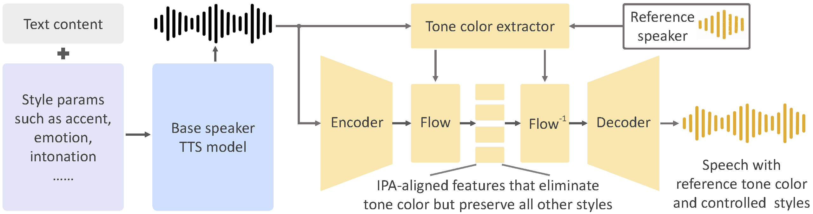

<div align="center">
  <div>&nbsp;</div>
 <!--  -->

[Paper](https://arxiv.org/abs/2312.01479) |


</div>

## Unisciti alla Nostra Comunità

## Introduzione
Come dettagliato nel [paper](https://arxiv.org/abs/2312.01479) i vantaggi di questo progetto sono tre:

**1. Clonazione Accurata del Tone Color.**
può clonare accuratamente il colore del tono di riferimento e generare discorsi in molteplici lingue e accenti.

**2. Controllo Flessibile dello Stile della Voce.**
permette un controllo granulare sugli stili vocali, come emozione e accento, così come altri parametri di stile inclusi ritmo, pause e intonazione.

**3. Clonazione Vocale Cross-linguistica Zero-shot.**
Né la lingua del discorso generato né la lingua del discorso di riferimento devono essere presentate nel massiccio dataset di addestramento multilingue con molti speaker.

<div align="center">
  <div>&nbsp;</div>
    
  <div>&nbsp;</div>
</div>


## Live Demo

<div align="center">
    <a href="https://www.lepton.ai/playground/openvoice"></a>
    &nbsp;&nbsp;&nbsp;&nbsp;
</div>

## Installation
Clone this repo, and run
```
conda create -n openvoice python=3.9
conda activate openvoice
conda install pytorch==1.13.1 torchvision==0.14.1 torchaudio==0.13.1 pytorch-cuda=11.7 -c pytorch -c nvidia
pip install -r requirements.txt
```
Download the checkpoint from [here](https://myshell-public-repo-hosting.s3.amazonaws.com/checkpoints_1226.zip) and extract it to the `checkpoints` folder 

## Utilizzo

**1. Controllo Flessibile dello Stile della Voce.**
Si prega di consultare [`demo_part1.ipynb`](demo_part1.ipynb) per un esempio di utilizzo su come OpenVoice permette un controllo flessibile dello stile sulla voce clonata.

**2. Clonazione Vocale Cross-Linguistica.**
Si prega di consultare [`demo_part2.ipynb`](demo_part2.ipynb) per un esempio per lingue viste o non viste nel set di addestramento MSML.

**3. Utilizzo Avanzato.**
Il modello di base dello speaker può essere sostituito con qualsiasi modello (in qualsiasi lingua e stile) preferito dall'utente. Si prega di utilizzare la funzione `se_extractor.get_se` come dimostrato nella demo per estrarre l'incorporamento del colore del tono per il nuovo speaker di base.

**4. Suggerimenti per Generare un Discorso Naturale.**
Ci sono molti metodi TTS di singolo o multi-speaker che possono generare un discorso naturale, e sono facilmente disponibili. Sostituendo semplicemente il modello di base dello speaker con il modello che si preferisce, è possibile aumentare la naturalità del discorso al livello desiderato.

## Cose fatte finora 

- [x] Inference code
- [x] Tone color converter model
- [x] Multi-style base speaker model
- [x] Multi-style and multi-lingual demo
- [x] Base speaker model in other languages
- [x] EN base speaker model with better naturalness
